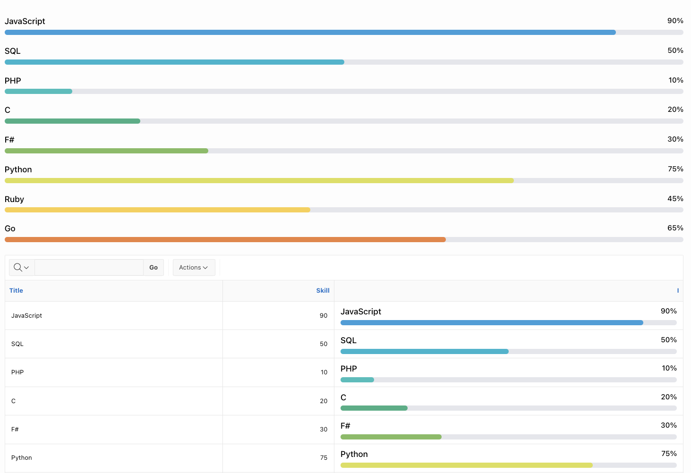
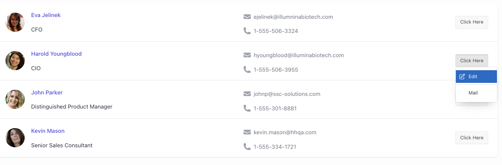

# Oracle APEX 23.1 Template Component Examples

Read about Template Components in [my blog post](https://hartenfeller.dev/blog/oracle-apex-template-components-introduction). Or watch [my YouTube tutorial](https://youtu.be/oxqu61PJsSo) on how to program them.

## Progress Bar

[Source Code](./plugins/template_component_plugin_dev_hartenfeller_progress_bars.sql)

## Person List

[Source Code](./plugins/template_component_plugin_dev_hartenfeller_person_list_view.sql)
